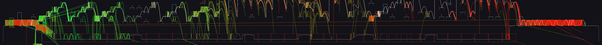
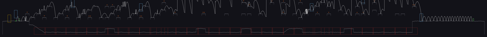

# 🍁 AFL fuzzing MapleStory for... successful jump quests

A coverage-guided fuzzer, driving the game client's physics, solving 18
MapleStory jump quests: Zakum's Breath of Lava, the Forests of Patience, the pet parks, Shumi's
subway construction site, the Physical Fitness Challenge and more. Every
solution is a file of key presses that replays tick for tick in the game
client, in the headless harness and in a browser build of the same client.

This reproduces the "AFL plays Super Mario Bros." demonstration from the IJON
paper ([Aschermann et al., *IJON: Exploring Deep State Spaces via Fuzzing*,
IEEE S&P 2020](https://group.cispa.io/abbasi/papers/aschermann2020ijon.pdf)) on an entirely different target: a popular online MMORPG game, which expects a server, a window and a GPU
and had to be made to run headless and deterministically first. It then pushes further:
platform graphs computed from the map data drive the feedback, campaigns are
chained through checkpoints, and the solutions are minimized (tmin) and speedrun.

**What this repository contains**: the fuzzing harness, the tooling, the
patches that add an offline replay mode to the open-source client, the
solutions (input files) and the plots.


*Top row: Breath of Lava 2, Deep Forest of Patience 2, Deep Forest of Patience 3. Middle: Forest of
Patience 1, Kerning Subway B1 Area 1, Kerning Subway B2 Area 2. Bottom: Ludibrium Pet Walkway,
Pet-Walking Road, Playground of Lupin. Played at 2x; the full-length recordings are linked in the
results table.*

## Results

18 jump quests solved by AFL + IJON driving the client, 12 cores.
"Solve" is the fuzzer's first solution (game ticks at 125 Hz; hits = HP lost); "best" is the
shortest copy after minimizing and speedrunning. Every input replays in the client; "video PoC" links the YouTube recording of the browser replay
of the original solve.

| Map | Quest | Solve | Best | Fuzzing time | Video PoC | Notes |
|---|---|---|---|---|---|---|
| 280020000 | Zakum: Breath of Lava 1 | 20352 ticks, 13 hits | 20164 (2026-09-08-min2) | ~4 h, 11 campaigns, 1 checkpoint | [2:41](https://www.youtube.com/watch?v=lVLehPiu22U) | lava, falling rocks, Firebombs, 25 ropes |
| 280020001 | Zakum: Breath of Lava 2 | 17930 ticks, 15 hits | 16684 (2026-09-09-0301-speed) | 1 h 39 min, no checkpoint | [2:14](https://www.youtube.com/watch?v=_Ln8W6lSCns) | fireballs, rocks, vents |
| 105040310 | Deep Forest of Patience 1 | 12184 ticks, 4 hits | 11512 (2026-09-09-1606-min2) | 4 h stuck, then 2 h with 13 checkpoints | [1:35](https://www.youtube.com/watch?v=DoLsvx675zM) | the tower that shaped the tooling |
| 105040311 | Deep Forest of Patience 2 | 12800 ticks, 10 hits | 11984 (2026-09-09-1746-min2) | 1 h 39 min, 11 checkpoints | [1:37](https://www.youtube.com/watch?v=TGqxvyJeHLU) | ropes grabbed by jumping with UP |
| 105040312 | Deep Forest of Patience 3 | 14360 ticks, 11 hits | 13912 (2026-09-10-0301-min) | 1 h 45 min stuck, then 65 min | [1:52](https://www.youtube.com/watch?v=HYAydCPwU_A) | 540 px steered drop; route metric |
| 100000202 | Henesys Pet-Walking Road | 17244 ticks, 0 hits | 6148 (2026-09-09-2353-speed) | 4 h 20 min incl. rule/metric changes | [0:50](https://www.youtube.com/watch?v=Jpq9s5JwnSQ) | far-left climb, two ropes, portals reset |
| 220000006 | Ludibrium Pet Walkway | 9257 ticks, 0 hits | 6515 (2026-09-10-0155-speed) | 2 h, 14 checkpoints | [0:54](https://www.youtube.com/watch?v=0I82EDTmLw4) | first map with the finished tooling |
| 101000100 | Forest of Patience 1 (Ellinia) | 17328 ticks, 0 hits | 9928 (2026-09-10-0722-min3) | 4 h 20 min, 38 checkpoints | [1:21](https://www.youtube.com/watch?v=yPv9d-dwqEA) | tallest map; a 13 px take-off window |
| 103000901 | Kerning Subway B1 Area 2 (Shumi) | 3216 ticks, 6 hits | 2596 (2026-09-10-1455-min3) | 17 min, 2 checkpoints | [0:23](https://www.youtube.com/watch?v=8lx114I3qFs) | Stirges and a laser; the map's own in-map portal lifts 230 px |
| 103000907 | Kerning Subway B3 Area 2 (Shumi) | 4928 ticks, 8 hits | 3896 (2026-09-10-1543-min2) | 47 min (18 stalled), 4 checkpoints | [0:34](https://www.youtube.com/watch?v=kcz3Ww3Erng) | corridor with a floor under it: `--floor-y` so falls earn no IJON credit |
| 103000904 | Kerning Subway B2 Area 2 (Shumi) | 8564 ticks, 17 hits | 7760 (2026-09-10-1702-min2) | 78 min, 9 checkpoints | [0:55](https://www.youtube.com/watch?v=D_cuvJCkkaY) | 258 lasers; drop, cross the floor through the map's hidden portal pair, climb 1630 px |
| 103000906 | Kerning Subway B3 Area 1 (Shumi) | 15156 ticks, 24 hits | 14156 (2026-09-10-1928-min2) | 2 h 26 min, 13 checkpoints | [1:53](https://www.youtube.com/watch?v=pgG-UrBSQAA) | 2890 px tower of 65 px platforms; an hour on one 60 px jump next to a reset portal |
| 103000908 | Kerning Subway B3 Area 3 (Shumi) | 11716 ticks, 24 hits | 11216 (2026-09-10-2121-min) | 1 h 51 min, 15 checkpoints | [1:32](https://www.youtube.com/watch?v=IYMgtaq5sfs) | out of the pit through the map's h001/h002 warp pair, then a 2500 px laser tower |
| 103000903 | Kerning Subway B2 Area 1 (Shumi) | 5696 ticks, 12 hits | 4880 (2026-09-10-2157-min) | 35 min, 4 checkpoints | [0:39](https://www.youtube.com/watch?v=r-9sTkMWvFc) | seven hidden doors, five in a ring, two lead up; the run tries four before the right one |
| 103000900 | Kerning Subway B1 Area 1 (Shumi) | 8460 ticks, 12 hits | 8016 (2026-09-10-2352-min) | 1 h 54 min (20 stalled), 13 checkpoints | [0:43](https://www.youtube.com/watch?v=nwRw2lGsVwQ) | five-storey building with floors under the goal: the map that got the route-aware feedback |
| 109040003 | Physical Fitness Challenge 3 (event) | 15984 ticks, 6 hits | 15004 (2026-09-11-0329-min) | 2 h 17 min, 19 checkpoints | [2:01](https://www.youtube.com/watch?v=GJVqDcm2DbE) | 174-hop zig-zag of 70 px platforms across the full width |
| 109040004 | Physical Fitness Challenge 4 (event) | 8496 ticks, 10 hits | 7560 (2026-09-11-0447-min) | 1 h 17 min, 10 checkpoints | [1:01](https://www.youtube.com/watch?v=tXMXzLr9FV8) | 2075 px tower with moving animals and 16 mobs |
| 910020200 | Playground of Lupin Leading to Jump Stand (Lost Snipe event) | 7594 ticks, 4 hits | 6362 (2026-09-11-0549-speed) | 36 min, 5 checkpoints | [0:52](https://www.youtube.com/watch?v=HOM7ODdGm5g) | ladder tower from portal st00 to the Jump Stand reactor (`xy:` goal); its springboard siblings are not simulated |


Every input the fuzzer ever ran on Breath of Lava 2, drawn over the map (each campaign its own
colour), and the solving run alone:





## How it works

```
      game data (.nx)        client sources + offline-mode patch
             |                            |
             v                            v
      +-------------------------------------------------+
      |  headless client (real physics, no-op graphics)  |
      |  input bytes -> key presses, 1 byte = 4 ticks    |
      +-------------------------------------------------+
             |  map dump                     ^  route table:
             v                               |  platform -> hops to goal
      route model (platform graph, BFS) -----+

  +================= fuzzing loop (afl-fuzz + IJON) ==================+
  |                                                                   |
  |   seeds --> mutate --> run: prefix + input                        |
  |     ^                    |   ijon_max(slot = hops, value = x)     |
  |     |                    |   goal -> SOLVED (crash)               |
  |     |                    v                                        |
  |     |            queue + per-slot frontier inputs                 |
  |     |                    |                                        |
  |     |         rank by hops every 3 min                            |
  |     +-- stall? cut best input -> new prefix, restart              |
  |                          |                                        |
  |                     solution.bin                                  |
  +===================================================================+
                             |
                             v
                tmin.py   trace-guided shrinking      -> -min, -min2, -min3
                             |
                             v
                speedrun  afl-fuzz --speed, seeded     -> -speed
                          with the solutions
                             |
                             v
                browser replay (wasm client), same bytes, same tick
```

The client is [JourneyClient](https://github.com/pdaniel-trx/JourneyClient)
(a descendant of HeavenClient, an open-source MapleStory v83 client in C++),
in the [WebAssembly port](https://github.com/nmnsnv/maplestory-wasm) that runs the game in a browser. A small **offline
mode** (`patches/journeyclient-offline-mode.patch`, 1300 lines) spawns a
synthetic character on a map with no server, spawns the map's monsters from
its `life` node with a fixed seed (to obtain deterministic runs), and turns a byte stream into key
presses: one byte is a key mask (`LEFT=1 RIGHT=2 JUMP=4 UP=8 DOWN=16`) held
for four physics ticks (32 ms). The browser build reads the same replay from
its config file, so anything the harness finds can be watched in the game.

The **harness** (`harness/harness.cpp`) compiles the client's Stage, Player,
Physics, Portal, Mob and map-object code unchanged, with no-op stubs for
OpenGL, the window, audio and the socket layer. It loads the game data,
spawns on the map, starts AFL's deferred forkserver at that point (the
deterministic snapshot) and then feeds the input bytes, ticking the stage.
Damage traps (lava areas, falling rocks, lasers, spiked balls, thorns) and
monster touches cost 1 HP of 100, the character's two seconds of post-hit
invincibility included; falling into lava kills (to speed up the fuzzing process); a hidden portal without a
target sends the character back to the spawn; reaching the goal (the exit
portal, an NPC, or a map coordinate) is reported as `SOLVED` and, in normal
mode, as a crash so the fuzzer files it under `crashes/`.

Three things had to be made independent of the C++ standard library for a
replay to be identical under gcc, clang 6 and Emscripten: random
distributions (raw `mt19937` output), foothold ties at shared endpoints, and
the update order of map objects. Gameplay must never depend on unordered
container iteration order.

### The fuzzer: IJON's max feedback

IJON is an AFL fork with an `ijon_max(slot, value)` annotation: the fuzzer
keeps, per slot, the input that reached the largest value, and treats a new
maximum as new coverage. The paper's Mario annotation was one slot per screen
row, maximizing x. Here the feedback went through three generations:

1. **Distance to the goal per 16 px band** across the direction of travel,
   measured from the map corner farthest from the goal (so a staircase that
   first leads away from the exit still earns credit), only while standing on
   a platform or a rope (the apex of a failed jump otherwise earns as much as
   the landing), with 96 key-free ticks after the input so a jump started by
   the last byte is allowed to land. Zakum's falling rocks got the bands
   split further by the phase of the rock cycle.
2. **Ranking by route.** The tooling builds a graph of the map's platforms
   and ropes from the map dump, adds an edge wherever the client's jump model
   can land (4.9 px/tick up, 0.163 px/tick² gravity, 1.1 px/tick sideways),
   runs a BFS from the goal and ranks positions by hops to the goal. It
   replaced height and distance where those were blind: a 540 px steered
   drop into the correct tower on Deep Forest 3, a floor that runs under the
   exit.
3. **Route-aware IJON feedback** (`--route`). The same table, exported per
   platform (`platform -> hops to goal, x where the next hop starts`), is read
   by the harness: the IJON slot is the hop count and the value grows toward
   the take-off point of the next hop, or up a rope. A platform the model
   cannot connect to the goal earns nothing. This fixed the two maps where
   runs that dropped to a floor "closer" to the goal in pixels had starved
   the real frontier (Subway B3 Area 2 stalled 18 minutes, B1 Area 1 sat at
   38 hops until the switch; then 30 hops three minutes later and solved).

### Checkpoints

Once the best input is minutes long, every execution replays the solved part
and almost every mutation lands in it. The supervisor (`tools/night.sh`)
ranks the queue every three minutes and, when the best run has not improved
for five minutes or has advanced far enough, cuts the best input at a moment
where the character stands on ground, makes that the **prefix** the harness
replays before the forkserver snapshot, and restarts the campaign on short
continuations. A byte is exactly four ticks and the state after the prefix is
the state a full replay would have, so prefix plus continuation is an
ordinary input that replays identically in the browser. Stalls alternate
between a cut at the frontier and an "explore" cut at the newest IJON
frontier; a frontier that ends up inside the prefix rolls back.

Two fixes to make restarts work: `container-run.sh` merges IJON's per-slot
maxima into the seeds (they are usually not queue entries), and IJON is
patched (`patches/ijon-dry-run-feeds-max-map.patch`) so the dry run feeds
the max map from the seeds; without it the fuzzer skipped the long frontier
seeds and re-learned the map from the short ones.

### Minimizing

The fuzzer's solutions wander: jumps in place, hops up and back down, waits.
`tools/viz/tmin.py` shrinks a solution while it still solves no later than
before, in parallel, from candidates derived from the replay trace:

* **loops**: the stretch between two moments the character stands at the
  same spot is deleted (jumps in place, wandering, waiting);
* **flat jumps**: a take-off that lands at the same height is deleted or has
  its jump bit cleared;
* **walk splices**: the bytes between two grounded moments on the same height
  become a straight walk between the spots;
* **hop templates**: the stretch from one landing to a later one becomes
  "walk n, jump with the direction held, hold k", so wandering and failed
  attempts between two platforms collapse into one direct hop;
* and the classic byte-block deletions.

Henesys Pet-Walking Road went from 17244 ticks to **6148**, Forest of Patience 1
from 17328 to 9928. Maps whose hazards run on fixed cycles (Zakum's rocks,
the Deep Forest javelins) barely move: their waiting is waiting for a hazard.

### Speedrun mode

`--speed` turns the feedback into "reach each hop level as early as
possible": the value of a slot is how early the run first stands on it, and
solving is a normal exit whose tick goes to a slot of its own, so the
solutions themselves are seeds and every earlier solve is a new maximum.
`tools/speedrun.sh` fuzzes a solved map this way, minimizes the fastest
solving input and keeps it when it beats the best copy. It paid off on the
shorter maps (Ludibrium 6622 -> 6515 ticks, Henesys 6159 -> 6148, Playground
of Lupin 6385 -> 6362); on the long maps the fuzzer mostly reproduced its seeds, because a
random mutation of a 15000-tick input rarely stays solving and gets faster.

### What did not work, and what is out of reach

* Straight-line distance as feedback (generations 1) is blind on any map
  with a floor or a wrong tower near the goal. Route hops fixed it.
* Mid-air credit: a missed jump earned as much as a landing.
* AFL dislikes long seeds; without the IJON patch, restarts regressed to the
  floor three times in a row.
* Two of the Lost Snipe event towers ("Thornbush" and "Jumping Board Leading
  to Jump Stand") climb through springboard portals (WZ type 12) that the
  client does not simulate; only the ladder tower of the trio was solved.

## Repository layout

| Path | Contents |
|---|---|
| `harness/` | `harness.cpp`, the four platform stubs, `CMakeLists.txt`, the IJON toolchain `Dockerfile`, `run.sh`, `container-run.sh`, tests |
| `tools/` | `night.sh` (supervisor), `speedrun.sh`, `viz/` (route model and ranking, checkpoints, minimizer, history plots) |
| `patches/` | the offline-mode patch for JourneyClient (AGPL-3.0, as the client), the web page patch, the IJON dry-run patch |
| `solutions/` | the input files: original solve, minimized copies, speedrun copies, with a table per map |
| `results/<map>/` | `solution-summary.json`, progress plot of every input of every campaign, the solving path over the map, the map dump, screenshots of the browser replay |
| `docs/` | input format, how to reproduce |


